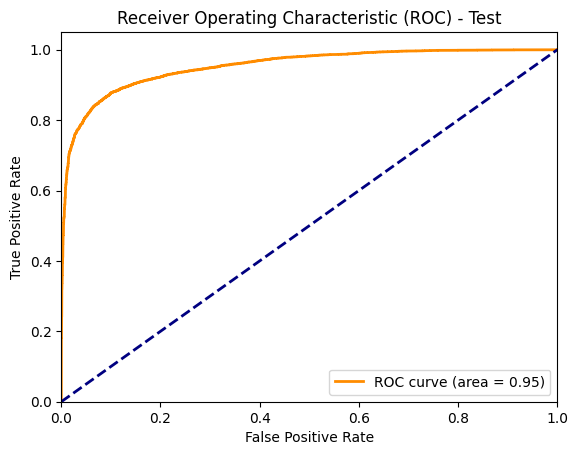

<center><h1>Code Exercise DS</h1></center>
<h2>Contenido</h2>

- [Objetivo](#objetivo)
- [Pasos para instalación](#pasos-para-instalación)
  - [Usando Docker](#usando-docker)
  - [Usando ambiente virtual](#usando-ambiente-virtual)
- [Resultados](#resultados)
    - [Selección de variables](#selección-de-variables)
    - [Medida de desempeño secundaria](#medida-de-desempeño-secundaria)
    - [Desempeño alcanzado](#desempeño-alcanzado)
    - [Hitos](#hitos)
- [Puesta en producción](#puesta-en-producción)
- [Variables](#variables)
    - [Variables no usadas](#variables-no-usadas)
- [Por mejorar](#por-mejorar)
- [Tecnologías](#tecnologías)
- [Librerias utilizadas](#librerias-utilizadas)
- [Recursos](#recursos)
- [Licencia](#licencia)
- [Autor](#autor)

## Objetivo
Usando la base de datos `MLA_100k_checked_v3.jsonlines` estimar un modelo de aprendizaje automático que permita predecir si un ítem del marketplace es nuevo o usado.

## Pasos para instalación

### Usando Docker
1. Utiliza el siguiente comando para construir las imágenes y levantar los contenedores:
```bash
docker-compose up --build
```
2. Acceder al contenedor.
```bash
docker-compose up
```

### Usando ambiente virtual
1. Clonar este repositorio localmente.
2. Crear un ambiente virtual.
   * Instalar virtualenv
   ```bash
   pip install virtualenv
   ```
   * Crear el ambiente virtual
    ```bash
    virtualenv env
    ```
    * Activar el ambiente virtual (windows)
    ```bash
    env\Scripts\activate
    ```
    * Activar el ambiente virtual (En macOS y Linux)
    ```bash
    source env/bin/activate
    ```
3. Installar los requerimientos de acuerdo al archivo [requirements.txt](https://github.com/juancadh/item_nuevo_usado/blob/main/requirements.txt)
    ```bash
    pip install -r requirements.txt
    ```
4. Abrir el proyecto con el editor de código de preferencia.
5. En la carpeta [Notebooks](https://github.com/juancadh/item_nuevo_usado/tree/main/notebooks) encontrará dos archivos:
   * [EDA.ipynb](https://github.com/juancadh/item_nuevo_usado/blob/main/notebooks/EDA.ipynb): Jupyter Notbook con el Exploratory Data Analysis (EDA).
   * [modelling.ipynb](https://github.com/juancadh/item_nuevo_usado/blob/main/notebooks/modelling.ipynb): Jupyter Notebook con para definir y evaluar el clasificador.
  

## Resultados

#### Selección de variables

Las variables fueron seleccionadas de acuerdo a los siguientes criterios ordenados (ver sección [Variables](#variables) para más detalle):

1. La variable no fue considerada si tenía más del 70% de valores nulos o vacíos. Se descartaron: *differential_pricing, catalog_product_id, subtitle, original_price, official_store_id, video_id, listing_source, coverage_areas, descriptions, international_delivery_mode, shipping_methods, shipping_dimensions*
2. La variable no fue considerada si todos sus valores eran repetidos con otra variable o si eran una transformación lineal de otra. Se descartó: *base_price*.
3. La variable no fue considerada si su valor representa un id, código o URL que no tiene información, significado o no se puede mappear con otras tablas. Se descartó: *deal_ids, thumbnail, secure_thumbnail, permalink, site_id, parent_item_id*.
4. Para las variable categóricas se tomaron aquellas variables que lograban separar bien las clases de nuevo o usado. Dentro del DEA, se utilizó la **prueba Chi-cuadrado sobre las tablas de contigencia** donde se esperaba rechazar la Hipótesis Nula de independencia para poder decidir si la variable era un buen predictor. Adicionalmente, se realizó un gráfico de violín para observar si las clases estaban separadas. 
5. Las dos variables de texto: *title* y *warranty* se incluyeron en el modelo usando un vectorizador TfiDF dado que se presumía que podian contener información relevante para la clasificación.
6. Al final, solo se contó con una variable continua: *price* (dado que varias de ellas se tranformaron a categóricas como se muestra en el DEA), la cual fue incluida en el modelo y se observó en esa etapa si aportaba o no para mejorar la medida de desempeño.
7. La lista de variables utilizada al final fue: *'title', 'price', 'sold_quantity_category', 'listing_type_id', 'days_active', 'buying_mode', 'available_quantity_category', 'shipping_local_pick_up', 'shipping_free_shipping', 'shipping_mode',
'has_variations', 'warranty'*.

#### Medida de desempeño secundaria
Adiconalmente a la medida de *Accuracy* que se solicitaba en el ejercicio, se utilizó el `Área bajo la curva ROC` (ROC AUC), la cual es una métrica robusta que evalua el rendimiento del modelo sin depender del umbral de clasificación y adicionalmente evita incurrir en falsos positivos. 

**Importancia para el negocio de la medida seleccionada:**
> La curva ROC traza la tasa de verdaderos positivos frente a la tasa de falsos positivos, por lo que se utiliza esta medida para **controlar los falsos positivos**. los falsos positivos se quieren evitar dado que se asume que **es más costosos para MELI predecir un producto como nuevo cuando en verdad era usado.** De cara al cliente, esto puede reducir la reputación y poner en juego el nombre del negocio.

#### Desempeño alcanzado
La siguiente tabla resume los resultados de los diferentes modelos de clasificación que fueron probados usando la medida de desempeño Accuracy y la medida propuesta de ROC AUC.
> El mejor modelo fue el modelo XGBoost con un accruacy en test de `0.8854` y un ROC AUC en test de `0.9541`

|                | **Baseline (Logit simple)** | **Logit Mejorado** | **XGBoost** | **SVC**  |
|----------------|-----------------------------|--------------------|-------------|----------|
| Train Accuracy | 0.8799                      | 0.9022             | 0.8942      | 0.8617   |
| Test Accuracy  | 0.8611                      | `0.8874`           | 0.8854      | 0.8378   |
| Train ROC AUC  | 0.9478                      | 0.9616             | 0.9635      | 0.9569   |
| Test ROC AUC   | 0.9338                      | 0.9534             | `0.9541`    | 0.9294   |

**Curva ROC - Modelo XGBoost (Test)**



#### Hitos
* Las cases 'nuevo' y 'usado' no están desbalanceadas (53.7% Nuevos, 46.3% Usados).
* Las variables no estructuradas de 'title' y 'warranty' se incluyeron en los modelos dado que estas aportaban información relevante para predecir las clases. Por ejemplo: Títulos como *'Guitarra eléctrica 5 años de uso'* pueden indicar que el producto es usado. Para esto se utilizó la representación vectorizada del texto usando TfIdF. Sin embargo, es posible mejorarlo usando una representación de embeddings que extraiga más y mejor información del texto.
* Se utilizó GridSearch con validación cruzada para optimizar los hiper-parámetros.

## Puesta en producción

Para poner en producción el modelo de clasificacion de items nuevos y usados, se recomienda implementar una API haciendo uso del modelo `Logit Mejorado` el cual tiene un muy buen desempeño frente a los otros competidores y además ofrece una baja latencia. 

En el archivo [for_deployment.py](https://github.com/juancadh/item_nuevo_usado/blob/main/for_deployment.py) se ha dispuesto un esquema de API sencilla utilizando el framework de Flask, sin embargo, se recomienda migrar a **Fast API** para mejorar la velocidad y la documentación. 

La API recibe como input la información en el mismo formato json con el que se entrenó el modelo (el mismo usado en la API de MELI) y entrega como resultado el siguiente formato JSON:

```json
{
    "prediction": "Nuevo", 
    "probability": 0.872321
}
```

Donde `prediction` correponde a la prediccion final estimada por el clasificador y `probability` corresponde a la probabilidad estiada del modelo.

## Variables
* **sellers_address** Ubicación del seller. (country, state, city).
* **warranty**: Texto que puede tomar cualquier forma dependiendo de lo que ingrese el seller.
* **variations**: Un item con multiples variaciones puede indicar que el item es nuevo.
* **sub_status**: Puede tomar el valor de 'deleted', 'expired', 'suspended', 'none'.
* **listing_type_id**: Categoría del tipo de publicación. Puede tomar el valor de 'bronze', 'silver', 'free', 'gold_special', 'gold', 'gold_premium', 'gold_pro'
* **buying_mode**: Puede tomar el valor de 'buy_it_now', 'classified', 'auction'.
* **tags**: Puede tomar los valores de 'free_relist', 'good_quality_thumbnail', 'dragged_bids_and_visits', 'poor_quality_thumbnail', 'dragged_visits'.
* **parent_item_id**: Id del item padre. No es informativo dado que los parent_item_id no aparencen en la lista de id de items, por lo que no se pueden mapear. Seguramente por el tamaño de la muestra.
* **category_id**: Id de la categoría. 
* **last_updated**: Ultima actualización.
* **accepts_mercadopago**: 1 si acepta mercadopago, 0 si no. Solo pocos tienen 0 pero los que son cero la mayoria venden usado.
* **currency_id**: Tipo de moneda. Puede tomar el valor de 'ARG', 'USD'. Hay muy pocos con 'USD'.
* **title**: Titulo de la publicación. Puede contener palabras clave que determinen si es nuevo o usado. 
* **automatic_relist**: Replublicación automática. Son pocas las que tienen en true, pero cuando lo tiene identifica bien la clase de nuevo.
* **status**: Estado de la publicacion. La mayoria son activos y unos pocos pausados. 
* **sold_quantity**: Nuero de ventas. Si ha venidio al menos uno puede ser un indicador que el producto es nuevo.
* **available_quantity**: Numero de unidades disponibles. Si tiene mas de una unidad puede ser un buen indicador de que el producto es nuevo.
* **shipping_local_pick_up**: Tipo de recogida del producto local?
* **shipping_free_shipping**: Tiene o no envio gratuido. Si tiene envio gratuito puede ser un buen indicador de que el producto es nuevo. 
* **shipping_mode**: El modo de entrega puede ayudar a identificar si es nuevo o usado. Toma los valores de 'custom', 'me1', 'me2', 'not_specified'.
  
#### Variables no usadas 
* **base_price**: Tiene exactamente los mismos valores que price (revisado)
* **deal_ids**: Contiene solo valores de deal ids sin relevencia. 
* **thumbnail**: No tiene imagenes. Solo una imagen default.
* **secure_thumbnail**: No tiene informacion relevante. Envia a una pagina forbidden.
* **permalink**: No tiene links relevantes. Se revisaron y estan expirados.
* **site_id**: Toma siempre el valor de MLA (Mercado Libre Argentina)
* **sellers_country**: Siempre toma el valor de Argentina.
* **parent_item_id**: Id del padre, no me dice nada por la poca cantidad de datos.
* **differential_pricing**: Todos los valores son nulos.
* **catalog_product_id**: Todos los valores son nulos.
* **subtitle**: Todos los valores son nulos.
* **original_price**: Todos los valores son nulos.
* **official_store_id**: Todos los valores son nulos.
* **video_id**: Todos los valores son nulos.
* **listing_source**: Todos los datos estan en blanco.
* **coverage_areas**: No contiene información. Solo arreglos vacios.
* **descriptions**: Lista de id. Se puede omitir. 
* **international_delivery_mode**: No tiene datos.
* **shipping_methods**: No tiene información. Todo vacio. 
* **shipping_dimensions**: No tiene informacion relevante. 

## Por mejorar

1. Dado el recurso limitado del tiempo y la capacidad de computo, se siguiere mejorar la optimizacion de los hiperparametros de los modelos lo cual puede mejorar el desempeño.
2. Incluir una etapa de selección de features usando alguna tecnica como KNN, Random Forest Feature Selection o Recursive Feature Elimination (RFE) entendiendo estadisticamente la importancia que tiene cada una de estas en la predicción final.
3. Realizar un analisis post-estimación como SHAP values para entender mejor como interactua cada variable en la probabilidad de predecir nuevo o usado. 

## Tecnologías
*   Python 3.11.3
*   Git / Github
*   Postman -- Para revisar que la API funcione.

## Librerias utilizadas
* pandas
* numpy
* sklearn
* xgboost
* matplotlib
* tensorflow
* keras
* joblib
* flask

## Recursos
* [Chi-square test in contingency tables](https://towardsdatascience.com/chi-square-test-for-feature-selection-in-machine-learning-206b1f0b8223) - Used to DEA and feature selection

## Licencia
> Este proyecto tiene licencia MIT

## Autor
> **Juan Camilo Díaz Herrera** (<https://github.com/juancadh>)


